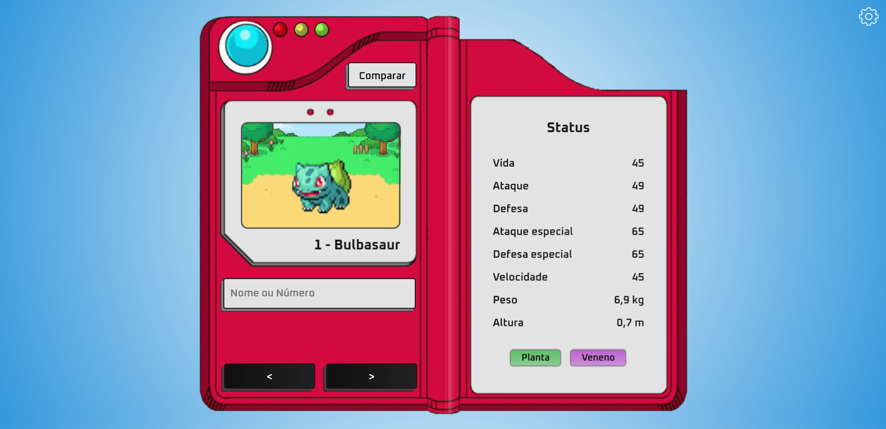
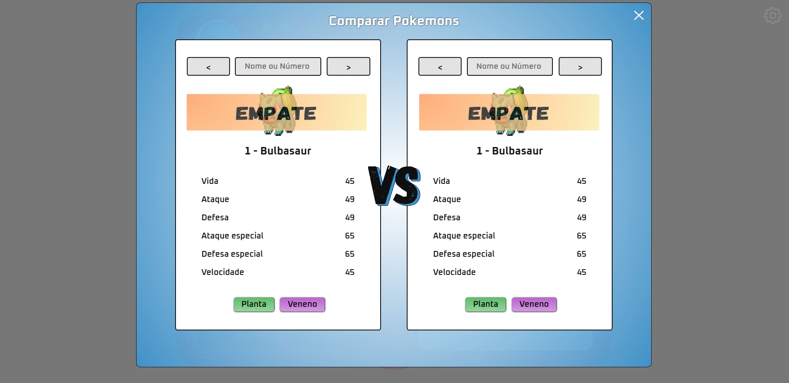

# Pokédex

## Visão Geral

O sistema para a Pokédex é uma plataforma interativa que permite aos usuários explorar o universo Pokémon de maneira detalhada e personalizada. Ele consiste em um catálogo digital que abriga uma variedade de Pokémon, cada um com suas características únicas, como imagem, nome, número, estatísticas e tipo.

## Requisitos Funcionais (RF)

* O sistema deve oferecer um design de Pokédex otimizado tanto para desktop quanto para mobile.
  
* O sistema deve oferecer uma funcionalidade de pesquisa que permita aos usuários procurar um Pokémon específico usando seu nome ou número de identificação.
  
* O sistema deve permitir a visualização do ID e do nome do Pokemon.
  
* O sistema deve permitir a visualização da imagem do Pokemon.
  
* O sistema deve permitir a navegação entre os Pokémon usando botões de navegação distintos, um botão ‘Próximo’, que permite ao usuário avançar para o Pokémon seguinte, e um botão ‘Anterior’, que permite ao usuário retornar ao Pokémon que foi visualizado anteriormente.
  
* O sistema deve permitir a visualização detalhada dos status (vida, ataque, defesa, ataque especial, defesa especial, velocidade, peso e altura) de cada Pokémon.
  
* O sistema deve estabelecer conexão com a PokéAPI.
  
* O sistema deve permitir a visualização do tipo do Pokemon.
  
* O sistema deve ter uma engrenagem de opções contendo: Modo escuro, Versão Shiny e Pokemon verso.
  
* O sistema deve permitir a ativação do modo escuro.
  
* O sistema deve permitir a visualização de versões Shiny dos Pokémon.
  
* O sistema deve oferecer a opção de visualizar a aparência posterior de cada Pokémon.
  
* O sistema deve traduzir as informações vindas da PokéAPI para o português, incluindo o tipo do Pokémon (por exemplo, "bug" para "inseto").
  
* O sistema deve ajustar automaticamente as medidas de peso e altura para o formato brasileiro (quilogramas e metros), para facilitar a compreensão dos usuários.
  
* O sistema deve ter a opção de comparar Pokemons, analisando qual ganharia em um combate, levando em consideração o status e o elemento.

* O sistema deve fornecer uma explicação sobre o resultado do combate. Este campo deve esclarecer como os status e tipos dos Pokemons influenciam o resultado.

## Requisitos Não Funcionais (RNF)

* **Eficiência:** O sistema deve responder a buscas on-line em menos de 5 segundos.
  
* **Responsividade:** O sistema deve ser responsivo funcionando em vários dispositivos, incluindo desktop, tablet, mobile e notebook.

## Requisitos -1 (RIN)

* O sistema para a Pokédex nunca pode perder a conexão com a PokeAPI, pois isso interromperia a funcionalidade principal do sistema de buscar e renderizar os dados do Pokémon.

## Bônus

* O sistema deve sugerir os Pokemons de acordo com o input digitado.
* O sistema deve ser construído utilizando o Webpack para otimização de recursos e melhor desempenho.

## Como iniciar o projeto

* **Instalar as dependências:** Abra o terminal do VSCode e digite `npm i` para instalar as dependências necessárias para o projeto.

* **Instalar a extensão Live Server:** No VSCode, instale a extensão `Live Server`. Esta extensão permite que você execute um servidor de desenvolvimento local para visualizar o projeto no navegador.

* **Iniciar o Live Server:** Clique em `Go Live` no canto inferior direito do VSCode para iniciar o servidor. Isso deve abrir o projeto no seu navegador padrão.

* **Atualizar o bundle.js do webpack:** Para atualizar o arquivo bundle.js do webpack, abra o terminal do VSCode e digite `npm run dev`.

## Screenshots




## Documentação de apoio

```
https://pokeapi.co/
```

## Licença

Este projeto está licenciado sob a licença MIT - veja o arquivo [LICENSE](./LICENSE) para mais detalhes.
